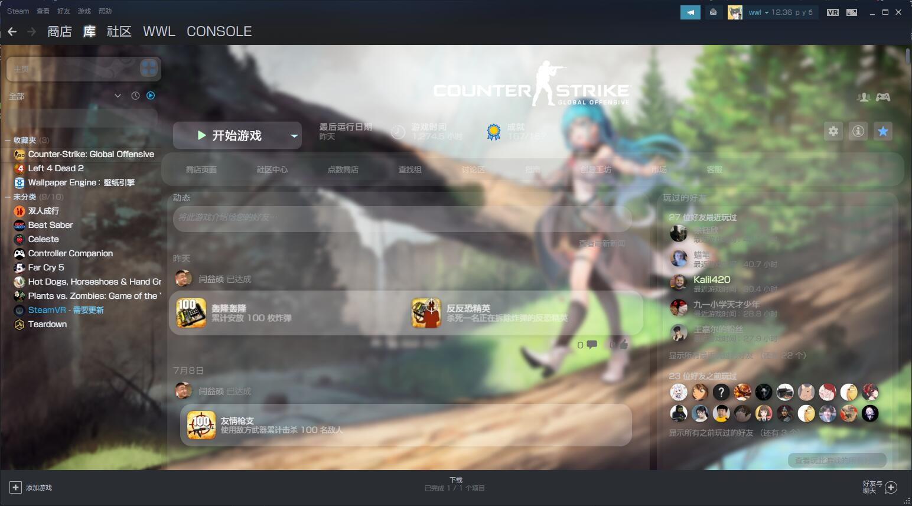

# SteamCustomStyle
[中文版本](#chinese)
## a customize Steam library UI Using Stylesheet


##Feature
- Customize fonts.
- Customize Background.
- Circle,Transparent and blur design.
- Some hover and click effect.
- Can custom from your self!

### Usage
- First, edit steam launch arguments, append  ```-noverifyfiles``` to launch argument.
- Go to steam Install dir, open ```steamui``` folder, put all files in.  
or you can simply put [css](css) file in, and edit [index.html](index.html), find ```<head>```
  block, append this:
  ```html
    <link href="/css/custom.css" rel="stylesheet">
    ```
- save files, restart steam, if work normally, you can see the steam Library ui is changed.
- To change the font, open [custom.css](css/custom.css), replace code like this:
```css
@font-face {
    font-family: CustomFont;
    src: url(./XHei_Square.TTC);
   /*↑Change this to you font path↑*/
}
```
and you can change the fonts. change the Background is same.
```css
body {
    background-image: url(bg.jpg)!important;
    /*↑Change this to you image path↑*/
    background-repeat: no-repeat!important;
    background-size: 100%!important;
}
```

<h1 id="chinese">中文版本</h1>
## 自定义化的Steam库主界面


##特色
- 可以自定义字体
- 可以修改背景图片
- 圆角,透明设计
- 添加了一些鼠标划入和点击的效果
- 可以进行自定义

### 使用方法
- 首先,右键你的steam快捷方式,添加  ```-noverifyfiles``` 到启动行中.
- 进入Steam所在的文件夹,打开 ```steamui``` 文件夹,把css和index.html放入文件夹中,进行全部覆盖 
  或者你可以只把 [css](css) 文件夹中的文件放入, 然后打开编辑 [index.html](index.html) 文件, 找到 ```<head>``` 标签,
  在后面插入:
  ```html
    <link href="/css/custom.css" rel="stylesheet">
    ```
- 保存文件,重启steam,如果操作没问题的话,你应该就会发现Steam库的背景和样式已经修改了.
- 如果想要自定义字体,打开 [custom.css](css/custom.css), 将前面的代码中的对应链接进行修改:
```css
@font-face {
    font-family: CustomFont;
    src: url(./XHei_Square.TTC);
   /*↑将上面url修改成字体文件的URL↑*/
}
```
然后字体应该就被修改了,修改背景图片也是类似:
```css
body {
    background-image: url(bg.jpg)!important;
    /*↑将上面的url修改成图片的URL↑*/
    background-repeat: no-repeat!important;
    background-size: 100%!important;
}
```